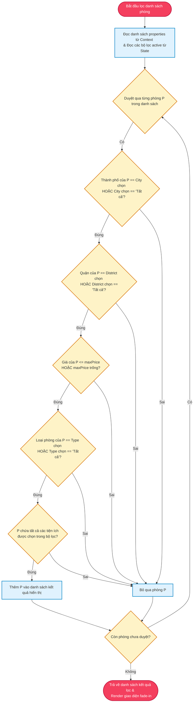
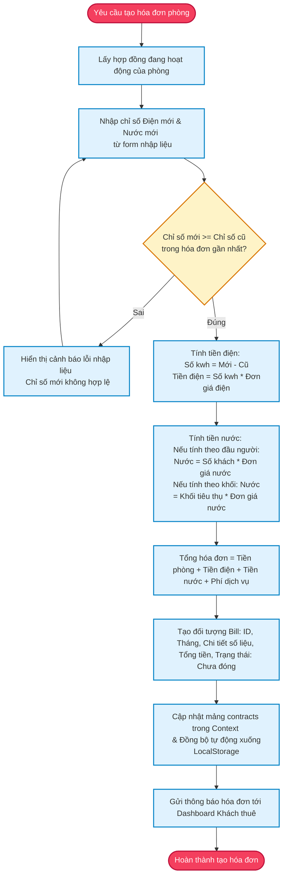
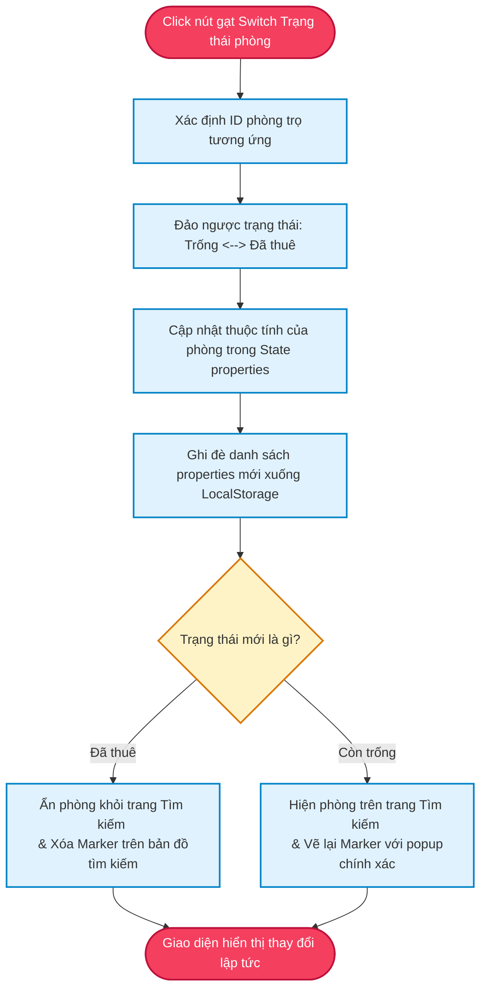
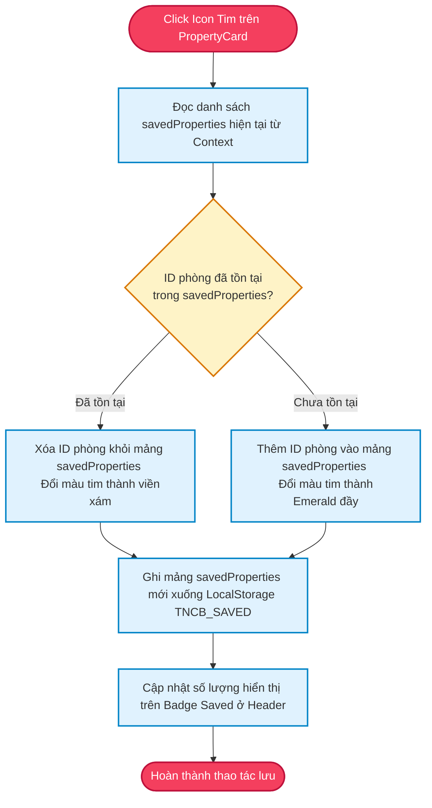

# Sơ Đồ Thuật Toán Khối Các Luồng Xử Lý (Project Algorithms)

Tài liệu này chi tiết hóa các thuật toán xử lý logic cốt lõi trong hệ thống TNCB Rent bằng các sơ đồ khối (Flowcharts), phục vụ việc hiện thực hóa mã nguồn chính xác nhất.

---

## 1. Thuật Toán Lọc & Tìm Kiếm Phòng Trọ (Search & Filter Logic)

Thuật toán này xử lý bộ lọc đa tiêu chí tại trang Tìm Kiếm (`Search.jsx`) dựa trên các thông số đầu vào từ người dùng mà không gây lag giao diện.

---

## 2. Thuật Toán Tính Hóa Đơn Điện Nước (Monthly Billing Calculation)

Dành cho Chủ trọ tại Dashboard (`Dashboard.jsx`), hệ thống tự động tính toán tổng số tiền dựa trên chỉ số điện nước tiêu thụ thực tế.

---

## 3. Thuật Toán Đồng Bộ Trạng Thái Phòng & Bản Đồ (Status Switch & Map Sync)

Khi chủ trọ thay đổi trạng thái trống của phòng trọ bằng Switch gạt trên bảng quản trị, hệ thống sẽ tự động cập nhật bản đồ chỉ dẫn để đảm bảo khách thuê không tìm thấy phòng đã cho thuê.

---

## 4. Thuật Toán Lưu Phòng Yêu Thích (Saved Properties Engine)

Cho phép Khách thuê lưu trữ các phòng trọ quan tâm để so sánh hoặc liên hệ sau.

