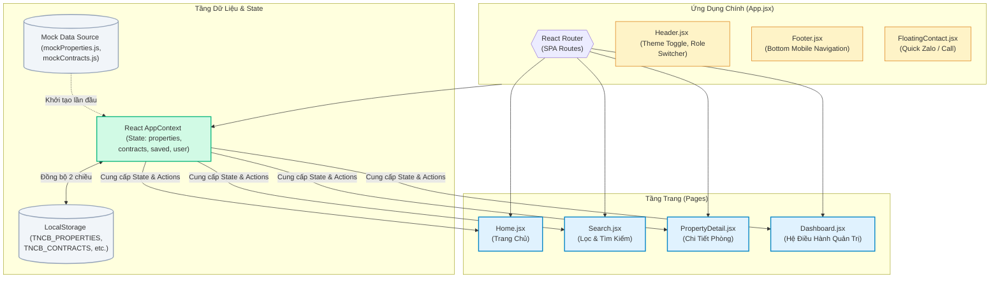
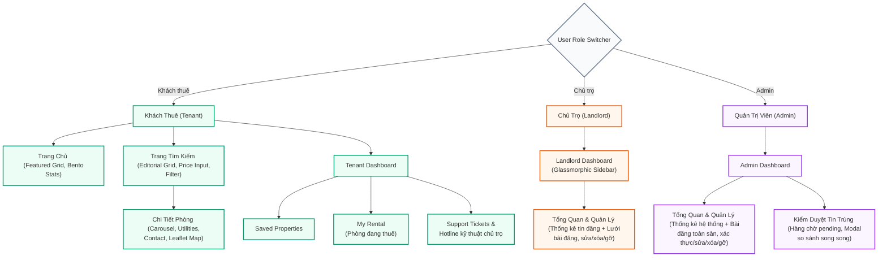
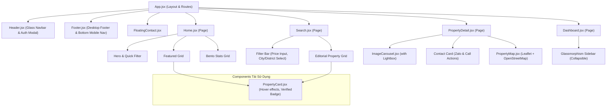

# Sơ Đồ Khối & Kiến Trúc Dự Án TNCB Rent (FTU Housing Bank)

Tài liệu này cung cấp cái nhìn tổng quan về kiến trúc hệ thống, sơ đồ khối, luồng dữ liệu và cấu trúc component của ứng dụng TNCB Rent, giúp định hình cấu trúc phát triển đồng bộ và tối ưu nhất.

---

## 1. Sơ Đồ Kiến Trúc Tổng Thể (System Architecture)

Dự án được xây dựng dưới dạng ứng dụng SPA chạy phía Client sử dụng React + Vite. Dữ liệu được quản lý tập trung qua **React Context (AppContext)** và lưu trữ bền vững tại **LocalStorage Database Engine** ở trình duyệt.

---

## 2. Luồng Nghiệp Vụ Theo Vai Trò (User Role Journeys)

Người dùng có thể chuyển đổi linh hoạt giữa 2 vai trò **Khách Thuê (Tenant)** và **Chủ Trọ (Landlord)** thông qua nút chuyển đổi nhanh trên Header.

---

## 3. Cấu Trúc Cây Component (Component Hierarchy)

Cây thư mục component được tổ chức tối giản để tái sử dụng tối đa và đảm bảo hiệu suất tải trang cao nhất:

---

## 4. Luồng Đồng Bộ Trạng Thái & Dữ Liệu (State & Storage Sync Flow)

Cơ chế cập nhật dữ liệu tự động giữa client-side state và LocalStorage được cấu trúc để đảm bảo tính liên tục của dữ liệu mà không cần server database phức tạp:

1. **Khởi tạo (App Load):**
   - Trình duyệt đọc dữ liệu từ `localStorage` thông qua các key `TNCB_PROPERTIES`, `TNCB_CONTRACTS`, `TNCB_VIEW_HISTORY`, và `TNCB_USER`.
   - Nếu `localStorage` trống, hệ thống sẽ nạp dữ liệu mặc định từ `mockProperties.js` và `mockContracts.js`, sau đó lưu ngược lại vào `localStorage`.

2. **Cập nhật & Lọc trùng (User Action & Deduplication Flow):**
   - Khi Chủ trọ thêm phòng trọ mới $\rightarrow$ Hệ thống chạy thuật toán kiểm tra trùng lặp (Haversine khoảng cách GPS + Jaccard văn bản tiêu đề/mô tả).
     - Nếu trùng lặp cao ($\ge 50\%$), thuộc tính `status` được đặt thành `'pending'` và kèm `duplicateReport` chi tiết, bài viết bị ẩn khỏi tập hiển thị công khai và đưa vào hàng chờ duyệt của Admin.
     - Nếu không trùng lặp (hoặc do Admin đăng), bài viết được đặt là `status: 'active'`.
   - Khi Chủ trọ/Admin thay đổi trạng thái thuê phòng (Trống $\leftrightarrow$ Đang thuê) hoặc gỡ bài đăng (Unlist $\leftrightarrow$ Publish) $\rightarrow$ React State `properties` cập nhật $\rightarrow$ kích hoạt `useEffect` ghi đè xuống `TNCB_PROPERTIES` trong `localStorage`.
     - Bài đăng ở trạng thái `isUnlisted === true` hoặc `status === 'pending'` sẽ lập tức được ẩn khỏi danh sách tìm kiếm công khai và bản đồ Leaflet.
   - Khi Khách thuê truy cập chi tiết phòng trọ $\rightarrow$ React State lịch sử xem tin tự động ghi nhận lượt xem mới, lọc bỏ các bản ghi đã quá 7 ngày $\rightarrow$ ghi đè xuống `TNCB_VIEW_HISTORY` trong `localStorage`.
