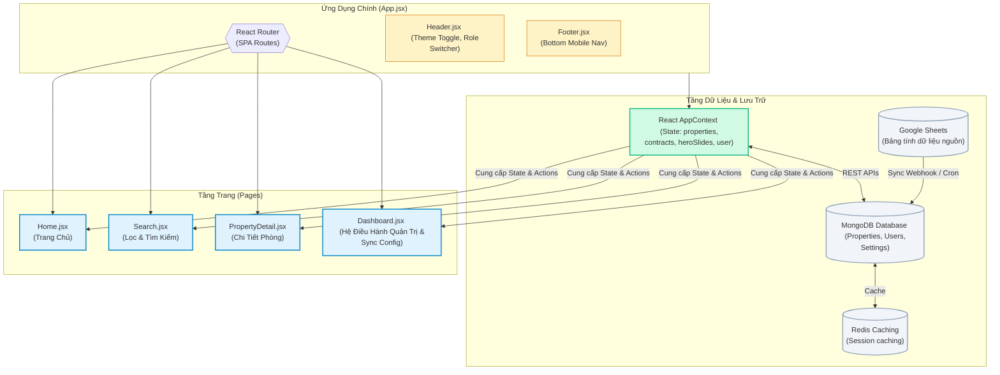
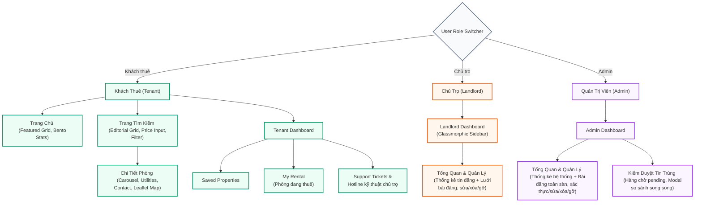
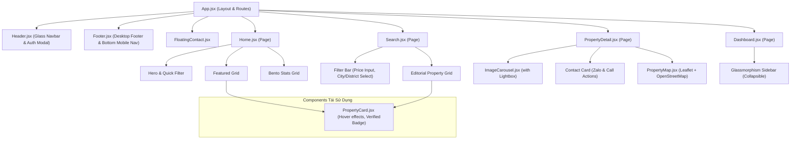

# Sơ Đồ Khối & Kiến Trúc Dự Án TNCB Rent (FTU Housing Bank)

Tài liệu này cung cấp cái nhìn tổng quan về kiến trúc hệ thống, sơ đồ khối, luồng dữ liệu và cấu trúc component của ứng dụng TNCB Rent, giúp định hình cấu trúc phát triển đồng bộ và tối ưu nhất.

---

## 1. Sơ Đồ Kiến Trúc Tổng Thể (System Architecture)

Dự án được xây dựng dưới dạng mô hình Client-Server. Frontend là ứng dụng SPA sử dụng React + Vite, giao tiếp qua REST APIs với Backend Node.js/Express (Modular Monolith) và lưu trữ bền vững tại cơ sở dữ liệu MongoDB. Caching được hỗ trợ qua Redis. Đồng bộ dữ liệu cũng hỗ trợ qua Google Sheets Sync (tự động, thủ công hoặc webhook tức thời).

## 2. Luồng Nghiệp Vụ Theo Vai Trò (User Role Journeys)

Người dùng có thể chuyển đổi linh hoạt giữa 2 vai trò **Khách Thuê (Tenant)** và **Chủ Trọ (Landlord)** thông qua nút chuyển đổi nhanh trên Header.

---

## 3. Cấu Trúc Cây Component (Component Hierarchy)

Cây thư mục component được tổ chức tối giản để tái sử dụng tối đa và đảm bảo hiệu suất tải trang cao nhất:

---

## 4. Luồng Đồng Bộ Trạng Thái & Dữ Liệu (State & Storage Sync Flow)

Cơ chế cập nhật dữ liệu tự động giữa client-side state và hệ thống Backend REST APIs/MongoDB được cấu trúc như sau:

1. **Khởi tạo & Đồng bộ Phiên (App Load & Session Sync):**
   - Trình duyệt đọc token JWT được lưu trữ trong `localStorage` để duy trì trạng thái đăng nhập.
   - Nếu tồn tại token, client gửi yêu cầu GET tới `/api/auth/me` để nạp thông tin tài khoản người dùng cùng các cấu hình bảo mật (`otpEnabled`, `mfaEnabled`).
   - Danh sách tin đăng trọ được fetch động thông qua API `/api/properties` kết nối trực tiếp với database MongoDB.

2. **Luồng Thách Thức Bảo Mật (MFA & Email OTP Challenge Flow):**
   - Khi gửi yêu cầu đăng nhập:
     - Nếu tài khoản đã kích hoạt **MFA** (ưu tiên cao nhất): Backend phản hồi trạng thái `requiresMfa` kèm token tạm thời, client chuyển modal sang luồng xác thực mã Authenticator.
     - Nếu tài khoản kích hoạt **Email OTP** (và không bật MFA, đồng thời không đăng nhập qua Google SSO): Backend gửi mã OTP về email đăng ký và phản hồi `requiresOtp`, client chuyển modal sang luồng điền mã xác thực OTP.
     - Sau khi người dùng điền đúng mã xác thực, backend cấp JWT session token chính thức để client lưu vào `localStorage`.

3. **Cập nhật & Lọc trùng (User Action & Deduplication Flow):**
   - Khi Chủ trọ thêm phòng trọ mới $\rightarrow$ API Backend chạy thuật toán lọc trùng tự động 3 lớp. Các bài viết trùng lặp cao sẽ được lưu dưới dạng `status: 'pending'` và chuyển vào hàng chờ duyệt của Admin.
   - Khi Khách thuê truy cập chi tiết phòng trọ $\rightarrow$ Client tự động cập nhật lịch sử xem tin vào `TNCB_VIEW_HISTORY` trong `localStorage` và tự động xóa các bản ghi đã quá 7 ngày để tránh phình dung lượng.
